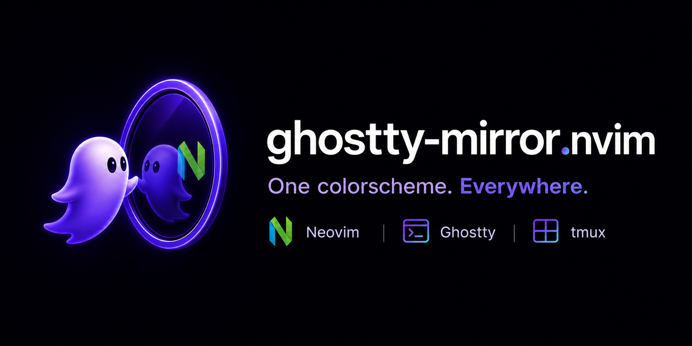

# ghostty-mirror.nvim




Mirror Neovim's colorscheme into [Ghostty](https://ghostty.org) (and, optionally,
tmux). When you run `:colorscheme foo` in Neovim, Ghostty's terminal theme flips
to match — across every open window, instantly.

https://github.com/user-attachments/assets/edb22f4a-2b3b-4704-9dae-88302277ea6e

The colorschemes in the demo are [scintilla.nvim](https://github.com/piacsek/scintilla.nvim) — my other plugin. Grab it if you like the look.

## Installation

Requires Neovim 0.10+.

### Step 1 — wire Ghostty to read the theme file

Add this to `~/.config/ghostty/config`:

```
config-file = ?~/.config/ghostty/theme-current
```

`config-file` is repeatable (won't clash with existing ones) and `?` makes it
optional (no error before the file exists). Put it **last** so the mirrored
theme overrides colors set earlier in your config.

### Step 2 — install the plugin

`vim.pack`:

```lua
vim.pack.add({ "https://github.com/piacsek/ghostty-mirror.nvim" })
```

`lazy.nvim`:

```lua
{
  "piacsek/ghostty-mirror.nvim",
  event = "VimEnter",
  cmd = { "ThemeFromGhostty", "ThemeToGhostty", "ThemeCacheClear" },
}
```

The plugin auto-registers the `ColorScheme` autocmd and the `ThemeFromGhostty`,
`ThemeToGhostty`, and `ThemeCacheClear` commands.

To override the defaults, call `setup`:

```lua
require("ghostty-mirror").setup({
  themes_dir = "~/.config/ghostty/themes",          -- where themes live / are cached
  theme_file = "~/.config/ghostty/theme-current",   -- the include file the plugin writes
  light_variant_suffix = "-light",                  -- light/dark variant routing
  generate = true,                                  -- false to require hand-made files
  reload_command = { "pkill", "-SIGUSR2", "ghostty" },
  debounce_ms = 150,                                 -- coalesce rapid switches (e.g. a picker's live preview); 0 = immediate
  overrides = {},                                    -- per-theme tweaks merged into generation (see Per-theme overrides)
  manage_background = false,                         -- opt-in: keep &background honest across switches (see Troubleshooting)
  sync_on_startup = false,                           -- opt-in: on launch, apply the theme Ghostty currently points at
  sync_on_focus = false,                             -- opt-in: on FocusGained, re-sync to the theme another nvim last wrote
  tmux = { enabled = false },                        -- opt-in tmux statusline mirroring (see below)
})
```

## Usage

- `:colorscheme <name>` in Neovim → Ghostty flips to the matching theme
  (hand-made file if present, otherwise generated on the fly).
- `:ThemeFromGhostty` → pull Ghostty's current theme into this Neovim instance.
  Run this in other nvim windows (across tmux panes, for example) to keep them
  in sync without restarting them. Set `sync_on_focus = true` to do this
  automatically whenever a window regains focus. Inside tmux this needs
  `set -g focus-events on` in your `tmux.conf`, otherwise tmux swallows the
  focus events and panes won't re-sync on switch.
- `:ThemeToGhostty` → force-regenerate the current colorscheme's theme from
  live highlights, overwriting any cached/hand-made file. Handy after you
  tweak a colorscheme's options and want Ghostty to pick up the new colors.
- `:ThemeToTmux` → force-regenerate the current colorscheme's tmux theme (when
  tmux mirroring is enabled). The tmux analog of `:ThemeToGhostty`.
- `:ThemeCacheClear` → delete generated theme files (recognized by their header),
  leaving hand-made ones untouched. Use it when a cached theme has gone stale;
  the next `:colorscheme` regenerates fresh.

Background and foreground mirror for *any* colorscheme; the ANSI `palette` only
when the scheme sets its own `g:terminal_color_*` (some, like catppuccin, gate
it behind `term_colors`). See [How it works](#how-it-works) for the details and
the hand-made-file escape hatch.

### tmux

Opt in to mirror the colorscheme into tmux's statusline too:

```lua
require("ghostty-mirror").setup({
  tmux = {
    enabled = true,                                  -- off by default
    themes_dir = "~/.config/tmux/themes",            -- per-theme .conf files live / are cached here
    theme_file = "~/.config/tmux/theme-current.conf",-- pointer file the plugin writes + sources
    bar_blend = 0.22,                                -- status bar = Normal bg blended this far toward the accent
    accent_hl = "Type",                              -- highlight group whose fg is the bright accent (selected window)
    divider_hl = "WinSeparator",                     -- inactive pane border color
    overrides = {},                                  -- per-theme tweaks, see below
    -- reload_command = { "tmux", "source-file", "<theme_file>" },  -- default; override to taste
  },
})
```

On `:colorscheme` the plugin writes `set -g *-style` lines to
`themes_dir/<name>.conf`, points `theme_file` at it, and runs `tmux source-file`.
The opinion, all highlight-derived so it follows any scheme:

- **Bar** = the theme background blended toward the accent — toward the
  *foreground* on light themes, since a light bg barely moves toward a mid-tone
  accent. Every base segment (incl. `status-left`) shares this one color.
- **Accent** (selected window, active divider) = the fg of a highlight group
  (`accent_hl`, default `Type`), harmonizing with each scheme's hue; text on it
  is contrast-picked. It shows only on the current window — plus a `status-right`
  pill on dark themes (light themes stay single-color).
- **Inactive divider** = `WinSeparator`.

**Two considerations for your `tmux.conf`:**

1. tmux applies colors via `*-style` options, so your `window-status-format` /
   `window-status-current-format` must **not** hardcode colors inline (`#[bg=…]`
   overrides the style). Keep them layout-only, e.g. `" #I #W "`.
2. To survive a tmux *server* restart, source the pointer once at startup,
   *after* your own theme block:
   ```tmux
   if-shell "test -f ~/.config/tmux/theme-current.conf" \
     "source-file ~/.config/tmux/theme-current.conf"
   ```

To hand-author a theme instead of generating one, drop a
`themes_dir/<name>.conf` — it always wins over generation, exactly like Ghostty
([guide](docs/manual_tmux_themes.md)).

<details>
<summary>How I wire it into my <code>tmux.conf</code></summary>

```tmux
# Colors can be overridden by re-setting these options after your own theme
# block — that's exactly what ghostty-mirror's generated theme does on reload.

# Window labels: name only, color-free, so the styles from the generated theme
# apply (an inline #[bg=…] would override them).
set-window-option -g window-status-format " #W "
set-window-option -g window-status-current-format " #W "

# Re-apply the last mirrored theme on server start (the plugin only sources
# it into a running server).
if-shell "test -f ~/.config/tmux/theme-current.conf" \
  "source-file ~/.config/tmux/theme-current.conf"

# Forward focus events so sync_on_focus fires when you switch panes.
set-option -g focus-events on
```
</details>

### Per-theme overrides

When generation is almost right, tweak a single theme from config instead of
hand-authoring a whole file. Both targets take the same shape: top-level
`overrides` for Ghostty themes, `tmux.overrides` for tmux:

```lua
require("ghostty-mirror").setup({
  overrides = {
    ron = {
      cursor_color = "#ffaabb",
      palette = { [3] = "#cc8800" },
    },
  },
  tmux = {
    overrides = {
      ron = { accent = "#fff", divider = "#ccc", bar_blend = 0.3 },
    },
  },
})
```

Keys are *resolved* theme names, so a light variant gets its own entry
(`cyberdream-light`). Colors are `#rgb` or `#rrggbb`.

Ghostty params: `foreground`, `cursor_color`, `cursor_text`,
`selection_background`, `selection_foreground` (underscores map to Ghostty's
dashed directives) and `palette`, a table of individual ANSI slots keyed
0..15. A color param replaces its highlight-derived value and is emitted even
when the highlight lacks one; palette slots substitute into the scheme's own
palette, or are emitted as a partial palette when the scheme owns none.
There's deliberately no `background` param: the terminal background diverging
from the editor's is exactly the mismatch the plugin exists to prevent.

tmux params: `accent`, `divider`, `bar` (colors) and `bar_blend` (0..1).
`accent`/`divider`/`bar_blend` replace the inputs of generation, so everything
derived from them (bar, pill text contrast, borders) recomputes coherently;
`bar` sets the status bar color directly, bypassing the blend (and
`bar_blend`).

Override edits apply on the next `:colorscheme` or restart — the cached file
regenerates and the target reloads automatically. One exception:
`cursor_color`/`cursor_text` land in the file immediately but Ghostty only
applies cursor colors on a full restart (see [Cursor color](#cursor-color)).
Setup warns about an override that can't take effect (unknown theme, unknown
param, invalid value); a bad value falls back to the highlight-derived color
rather than producing a broken theme. Overrides apply only to generated
themes; a hand-made file is never modified (edit it directly instead).

#### Who paints what

An override that "doesn't work" is usually another layer painting what you're
looking at. The override always lands in the theme file; whether you *see* it
depends on who renders that pixel:

| You're looking at | Painted by | Governed by |
|---|---|---|
| Text, background, Visual selection, cursor *inside nvim* | nvim | the colorscheme's highlights (`Normal`, `Visual`, `Cursor`) |
| Mouse-drag selection *inside tmux* | tmux copy-mode | the generated tmux theme's `mode-style` (from `accent`) |
| Prompt text, padding, Shift+drag selection, anything outside nvim/tmux | Ghostty | the theme file — where overrides apply |

So a `selection_background` override shows on a Shift+drag (bypasses tmux's
mouse reporting) or in a pane without tmux — a plain drag inside tmux is
tmux's selection, and Visual mode is nvim's. To recolor a layer, change that
layer's source: the scheme's highlights for nvim, the tmux `accent` for
copy-mode, the override for Ghostty.

### Cursor color

The generated theme includes a `cursor-color`, but **Ghostty only applies it on
a full restart** — it isn't re-read on a live config reload. So the cursor
won't follow `:colorscheme` through ghostty-mirror alone. To get a
theme-following cursor *inside Neovim*, point `guicursor` at the `Cursor`
highlight so Neovim sets the cursor color itself (via OSC 12):

```lua
vim.opt.guicursor = "n-v-c-sm:block-Cursor/lCursor,"
  .. "i-ci-ve:ver25-Cursor/lCursor,r-cr-o:hor20-Cursor/lCursor,"
  .. "t:block-blinkon500-blinkoff500-TermCursor"
```

This requires the colorscheme to define a `Cursor` highlight, and it governs
the cursor only while Neovim is focused — the shell-prompt cursor still comes
from Ghostty's config.


## How it works

A Ghostty theme is just a file at `~/.config/ghostty/themes/<name>` defining
`background`, `foreground`, and the 16-color `palette`. On `:colorscheme`, the
plugin writes `theme = <name>` to an include file (`theme_file`, default
`~/.config/ghostty/theme-current`) and signals Ghostty (`SIGUSR2`) to reload.

It picks `<name>` by precedence:

1. A [hand-made](docs/manual_themes.md)/cached file at `themes_dir/<name>` wins
   (honoring the `-light` variant when `&background` is `"light"`).
2. Otherwise it's **generated** from live highlights — `background`/`foreground`
   from `Normal`, `cursor-color`/`cursor-text` from `Cursor`,
   `selection-background`/`selection-foreground` from `Visual`, `palette` from
   `g:terminal_color_*` — and cached to
   `themes_dir/<name>` to hand-edit later. (`generate = false` requires
   hand-made files.)

The highlight-derived colors always belong to the current scheme, so they
mirror unconditionally. The palette is trickier: `g:terminal_color_*` is global
and *sticky*, so a scheme that sets none of its own inherits the previous one's.
The plugin snapshots it on `ColorSchemePre` and emits `palette` lines only when
the scheme actually changed it. Most schemes (tokyonight, kanagawa, gruvbox,
rose-pine, …) set it, so generation is zero-config; some (e.g. catppuccin) gate
it behind a `term_colors` option — for those, or for pixel-perfect control, drop
a hand-made file. `:ThemeToGhostty` bypasses this and writes the full live palette.

`ColorScheme` is **debounced** (`debounce_ms`, default 150) so a colorscheme
picker's live preview pushes once the selection settles, not per previewed
scheme. `:ThemeToGhostty` / `:ThemeToTmux` act immediately.

The plugin owns *only* the include file and the themes it generates — never your
main Ghostty config or hand-made theme files.

### Light/dark variants

Some plugins (cyberdream) use the same `g:colors_name` for light and dark, so
`ColorScheme` reports `cyberdream` either way. The plugin checks `&background`:
when it's `"light"` and a `<name>-light` file exists, that's used instead
(`light_variant_suffix`, default `-light`). Ship both `themes/cyberdream` and
`themes/cyberdream-light` and the right one loads automatically. The suffix
becomes part of file names and the pointer lines, so it's restricted to
letters, digits, `.`, `_` and `-` — `setup()` errors on anything else.

The pull direction understands these names too: when the theme file points at
a `<name>-light` that isn't an installed colorscheme of its own,
`:ThemeFromGhostty` (and the focus/startup syncs) applies the base scheme with
`&background` set to `"light"` first, so the variant reproduces.

## Troubleshooting

Run `:checkhealth ghostty-mirror` first — it flags the common environmental
causes (a missing `config-file` include in your Ghostty config — the [Step 1](#step-1--wire-ghostty-to-read-the-theme-file)
wiring — un-writable `themes_dir`/`theme_file`, a `reload_command` not on
`$PATH`, no running Ghostty, tmux enabled but not running).

- **Initial load.** The plugin doesn't fire on Neovim's startup colorscheme;
  opening a new nvim window won't reflow every Ghostty window. To have a
  freshly-opened nvim follow Ghostty's current theme instead, set
  `sync_on_startup = true` (it applies the theme from `theme_file` on
  `VimEnter`), or read it yourself:

  ```lua
  local lines = vim.fn.readfile(vim.fn.expand("~/.config/ghostty/theme-current"))
  local theme = lines[1] and lines[1]:match("theme%s*=%s*(%S+)")
  if theme then pcall(vim.cmd.colorscheme, theme) end
  ```

- **`SIGUSR2` reloads all Ghostty windows.** That's how Ghostty's config
  reload works today — there's no per-window override. Switching themes in
  any nvim flips every Ghostty window.

- **Plugin colorschemes load late.** Setting `:colorscheme some-plugin` in
  `init.lua` before plugins load fails — wrap it in `pcall` and retry on
  `VimEnter`. Normal use is unaffected.

- **A light scheme can leave `&background` stuck.** Some schemes (catppuccin-latte)
  set `background=light` and never reset it, so an `&background`-adaptive scheme
  loaded afterwards (the built-in `default`) renders its *light* variant — which
  the plugin faithfully mirrors. If `default` looks washed-out after a light
  scheme, that's the cause. Set `manage_background = true` to have the plugin
  handle it, or wire the autocmds yourself.

  <details>
  <summary>Autocmds that keep <code>&background</code> honest</summary>

  ```lua
  -- Baseline &background to dark before a scheme loads, then sync it to the
  -- loaded scheme's actual Normal-bg luminance. Both writes are guarded, since
  -- writing &background re-applies the scheme and re-fires these events.
  local group = vim.api.nvim_create_augroup("background-honest", { clear = true })
  local adjusting = false
  local function set_bg(want)
  	if vim.o.background ~= want then
  		adjusting = true
  		vim.o.background = want
  		adjusting = false
  	end
  end
  vim.api.nvim_create_autocmd("ColorSchemePre", {
  	group = group,
  	callback = function() if not adjusting then set_bg("dark") end end,
  })
  vim.api.nvim_create_autocmd("ColorScheme", {
  	group = group,
  	callback = function()
  		if adjusting then return end
  		local n = vim.api.nvim_get_hl(0, { name = "Normal" })
  		if type(n.bg) ~= "number" then return end
  		local r, g, b = math.floor(n.bg / 65536) % 256, math.floor(n.bg / 256) % 256, n.bg % 256
  		set_bg((0.299 * r + 0.587 * g + 0.114 * b) / 255 > 0.5 and "light" or "dark")
  	end,
  })
  ```
  </details>

## Development

The plugin has a plenary-based test suite. With plenary installed via your
plugin manager (or fetched into `~/.local/share/nvim/site/pack/vendor/start/`),
run:

```sh
make test
```

CI runs the same on stable and nightly Neovim.

See the [roadmap](ROADMAP.md) for planned milestones.

## License

MIT
